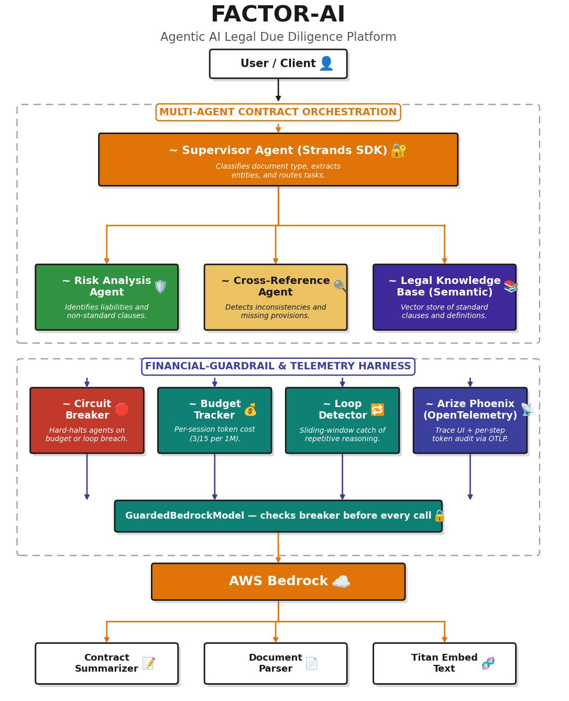

# ⚖️ Factor AI - Agentic AI Legal Due Diligence Platform 🔍

[](LICENSE)
[](https://python.org)
[](https://typescriptlang.org)
[](https://aws.amazon.com/bedrock/)
[](https://huggingface.co/datasets/Taylor658/synthetic-legal)
[](https://ataylor.getform.com/5w8wz)

**Autonomous AI agents that batch analyze legal contracts for missing provisions, unusual terms, and risk flags - powered by AWS Strands Agents SDK and Amazon Bedrock AgentCore.**

> 🚧 **Status:** Core agents stable · Dashboard live · AgentCore deployment ready

---

## 🤔 The Problem

M&A and financing due diligence requires reviewing 10–100+ contracts to identify missing clauses, non-standard terms, and cross-document inconsistencies. Manual review is slow, expensive, and error-prone.

---

## 💡 The Solution

Factor AI deploys a system of **autonomous AI agents** that collaboratively analyze batches of legal documents:

- **Ingest** PDF, DOCX, and TXT files, extracting and chunking provisions (unreadable files are skipped with a reason, never silently dropped)
- **Classify** each contract (NDA, lease, loan, merger, employment, license, supply) to select the right checklist
- **Detect** provision types using pattern matching and AI classification
- **Score** risk levels against configurable rubrics
- **Identify** missing critical clauses via gap analysis
- **Compare** provisions across documents for inconsistencies
- **Generate** structured risk reports with Excel and HTML export
- **Guard** every reasoning step with a financial circuit breaker and Arize Phoenix telemetry

---

## 🏛️ Architecture

```
┌─────────────────────────────────────────────────────────┐
│                    FACTOR AGENT SYSTEM                   │
│                                                         │
│  ┌───────────────────────────────────────────────────┐  │
│  │            Coordinator Agent                       │  │
│  │  Receives document batch, plans analysis strategy, │  │
│  │  delegates to specialist agents, assembles report  │  │
│  └──────────┬──────────┬──────────┬─────────────────┘  │
│             │          │          │                      │
│    ┌────────▼──┐ ┌─────▼─────┐ ┌─▼──────────┐         │
│    │ Ingestion │ │ Analysis  │ │ Knowledge  │         │
│    │   Agent   │ │   Agent   │ │   Agent    │         │
│    │ • Parse   │ │ • Detect  │ │ • RAG      │         │
│    │ • Chunk   │ │ • Score   │ │ • Classify │         │
│    │ • Extract │ │ • Gaps    │ │ • Citations│         │
│    └───────────┘ │ • Compare │ └────────────┘         │
│                  └───────────┘                          │
│    ┌─────────────┐                                      │
│    │  Reporting   │                                     │
│    │    Agent     │                                     │
│    │ • Reports   │                                     │
│    │ • Excel     │                                     │
│    │ • HTML      │                                     │
│    └─────────────┘                                      │
│                                                         │
│  ┌───────────────────────────────────────────────────┐  │
│  │  FINANCIAL-GUARDRAIL & TELEMETRY HARNESS           │  │
│  │  Circuit Breaker │ Budget Tracker │ Loop Detector  │  │
│  │  GuardedBedrockModel → audits token I/O per step   │  │
│  │  OpenTelemetry/OTLP → Arize Phoenix (traces UI)    │  │
│  └───────────────────────────────────────────────────┘  │
│                                                         │
│  ┌───────────────────────────────────────────────────┐  │
│  │  Bedrock AgentCore Runtime │ Memory │ Gateway      │  │
│  │  Policy │ Observability │ Identity                 │  │
│  │  Amazon Bedrock (Foundation Models)                │  │
│  │  S3 │ DynamoDB │ CloudWatch │ Cognito              │  │
│  └───────────────────────────────────────────────────┘  │
└─────────────────────────────────────────────────────────┘
```

---

## 🤖 Agent System

| Agent | Role | Tools | Status |
|-------|------|-------|--------|
| 🎯 **Coordinator** | Orchestrates pipeline, delegates tasks, assembles results | `ingest_documents`, `analyze_provisions`, `search_knowledge`, `generate_report` | ✅ Stable |
| 📄 **Ingestion** | Parses PDF/DOCX, chunks into provisions | `parse_pdf`, `parse_docx`, `chunk_provisions` | ✅ Stable |
| 🔍 **Analysis** | Detects types, scores risk, finds gaps, compares | `detect_provision_type`, `score_risk`, `find_gaps`, `compare_across_documents` | ✅ Stable |
| 📚 **Knowledge** | Searches synthetic KB, classifies domains, extracts citations | `search_synthetic_knowledge`, `classify_domain`, `extract_citations` | ✅ Stable |
| 📊 **Reporting** | Builds reports, exports Excel/HTML | `build_risk_report`, `export_excel`, `export_html` | ✅ Stable |

---

## ✨ Core Capabilities

- 🔍 **Provision Detection** - 14 provision types identified via anchor patterns; section headings (`GOVERNING LAW.`, `Section 5.`, `ARTICLE VII`) stay attached to their clause
- 🏷️ **Contract-Type Detection** - Whole-word signals pick the NDA / lease / loan / merger / employment / license / supply checklist for each document
- 📊 **Risk Scoring** - Configurable rubrics with weighted signals (0–10 scale)
- ⚠️ **Gap Analysis** - Standard checklists for NDAs, leases, loans, mergers, employment, license, and supply agreements
- 🔄 **Cross-Document Comparison** - Inconsistency detection across governing law, liability caps, termination terms, compared **document-to-document** (never clause-to-clause within one file)
- 🗂️ **Per-Document Attribution** - Every risk score and gap names its source file, clause type, and a text excerpt, in the dashboard and in exports
- 🧯 **Resilient Batches** - Corrupt, password-protected, or scanned (image-only) files are reported as *not analyzed* while the rest of the batch completes
- 📚 **RAG Knowledge Search** - Synthetic legal knowledge base (Taylor658/synthetic-legal)
- 📋 **Structured Reports** - Executive summary, risk assessment, gap analysis, comparison results
- 📥 **Export** - One-click download of Excel (with disclaimer tab) and HTML (with disclaimers on every page)
- ⚡ **SSE Streaming** - Real-time, per-document progress via Server-Sent Events; parsing and scoring run off the event loop so the server stays responsive
- 💰 **Financial Circuit Breaker** - Per-session token budget enforced at every LLM reasoning step; agents are hard-halted before runaway cost
- 🔁 **Reasoning Loop Detection** - Sliding-window detector halts agents stuck in repetitive, high-cost cycles
- 📡 **Phoenix Telemetry** - OpenTelemetry traces exported to a self-hosted Arize Phoenix instance for per-step token auditing
- 🛡️ **Session Isolation** - Cedar policies enforce per-user data access
- 🔒 **Upload Validation** - File type enforcement (PDF, DOCX, TXT) with size limits enforced while streaming to disk
- 🌐 **Production CORS** - Configurable origin restrictions for production deployments
- 🧹 **Automatic Cleanup** - Uploads are removed after analysis; sessions, reports, and exports expire automatically or on `DELETE`

---

## 📁 Repository Layout

```
factor/
├── src/factor/              # Python backend
│   ├── agents/              # Strands Agent definitions
│   ├── harness/             # Financial-guardrail & Phoenix telemetry harness
│   ├── tools/               # @tool decorated functions + contract-type detection
│   ├── knowledge/           # ChromaDB vector store + dataset loader
│   ├── models/              # Pydantic data models
│   ├── aws/                 # Bedrock, AgentCore, S3, Cognito
│   ├── reporting/           # HTML report templates
│   ├── db/                  # Session store (thread-safe)
│   ├── app.py               # FastAPI + SSE streaming
│   └── config.py            # pydantic-settings
├── src/frontend/            # React 18 + TypeScript + Vite
│   ├── nginx.conf           # Production proxy: dashboard + /api → factor-api
│   └── src/
│       ├── components/      # Upload, Analysis, Report, shared
│       ├── hooks/           # useUpload, useAnalysis, useAgentStream
│       ├── api/             # API client
│       └── types/           # TypeScript types
├── tests/                   # pytest test suite
├── scripts/                 # Seed KB, generate samples, deploy, benchmark
├── policies/                # Cedar policy files
├── data/                    # Provision definitions, risk rubric, samples
├── infra/                   # AWS CDK stacks
├── docker-compose.yml       # Self-hosted Arize Phoenix (telemetry)
└── docker/                  # API + Frontend Dockerfiles, docker-compose
```

---

## 💰 Financial-Guardrail & Telemetry Harness

When agents autonomously batch-analyze 100+ legal documents, the loop of reading, extracting, and comparing can lead to runaway token consumption. The harness wraps Bedrock AgentCore execution to **audit token input/output at every discrete reasoning step** and acts as a **financial circuit breaker** — ensuring the operating cost of the AI never outpaces the value of the analysis.

### How it works

```
Agent step → GuardedBedrockModel → CircuitBreaker.check()
                                       ├── SessionBudget   (token cost accounting)
                                       └── LoopDetector    (repetitive-cycle detection)
                                       ↓ trip → BudgetExceededError / ReasoningLoopError
OpenTelemetry span (gen_ai.usage.*) → GuardrailSpanProcessor → Arize Phoenix (OTLP)
```

| Component | Responsibility |
|-----------|----------------|
| `SessionBudget` | Accumulates input/output token cost per session (Sonnet pricing: $3 / $15 per 1M) |
| `LoopDetector` | Sliding-window detection of repeated reasoning actions |
| `CircuitBreaker` | Combines budget + step-limit + loop checks; raises to **hard-halt** the agent |
| `GuardedBedrockModel` | Proxy around `BedrockModel` that checks the breaker before every invocation |
| `FinancialGuardrail` | Singleton registry of per-session circuit breakers |
| `GuardrailSpanProcessor` | Extracts token counts from OTel spans and feeds the breaker; exports to Phoenix |

When a breaker trips, the `/api/v1/analyze` SSE stream emits a `guardrail_halt` event with the session's cost, step count, and trip reason.

> 💡 **What counts as a step:** the breaker meters **LLM reasoning steps** (model calls and their token spend). The deterministic `/api/v1/analyze` pipeline — parsing, regex detection, and rubric scoring — makes no model calls, so it is never counted against `GUARDRAIL_MAX_STEPS`. A batch of 100 contracts with thousands of clauses runs to completion.

### Start Phoenix (self-hosted)

```bash
# Launch the Phoenix telemetry UI + OTLP collector
docker compose up -d phoenix

# Phoenix UI:        http://localhost:6006
# OTLP gRPC:         localhost:4317
```

### Configuration

| Env Var | Default | Description |
|---------|---------|-------------|
| `PHOENIX_ENABLED` | `true` | Enable OTLP export to Phoenix |
| `PHOENIX_OTLP_ENDPOINT` | `http://localhost:6006/v1/traces` | Phoenix trace collector endpoint |
| `GUARDRAIL_ENABLED` | `true` | Enable the financial circuit breaker |
| `GUARDRAIL_SESSION_BUDGET_USD` | `5.0` | Hard cost ceiling per analysis session |
| `GUARDRAIL_MAX_STEPS` | `200` | Maximum LLM reasoning steps per session |
| `GUARDRAIL_LOOP_WINDOW` | `10` | Sliding window size for loop detection |
| `GUARDRAIL_LOOP_THRESHOLD` | `5` | Repeat count within window that trips a loop |
| `GUARDRAIL_INPUT_COST_PER_1M` | `3.0` | Input token price (USD per 1M) |
| `GUARDRAIL_OUTPUT_COST_PER_1M` | `15.0` | Output token price (USD per 1M) |

---

## 🏁 Getting Started

### Prerequisites

- ✅ Python 3.11+
- ✅ Node.js 20+
- ✅ AWS account with Bedrock access
- ✅ AWS CLI configured (`aws configure`)

### Installation

```bash
# Clone the repository
git clone https://github.com/ATaylorAerospace/Factor-AI.git
cd Factor-AI

# Create virtual environment
python -m venv .venv && source .venv/bin/activate

# Install Python dependencies
pip install -r requirements.txt

# Seed the knowledge base
python scripts/seed_knowledge_base.py

# Start the API server
uvicorn src.factor.app:app --reload --port 8000
```

### Frontend

```bash
cd src/frontend
npm install
npm run dev
```

### Run Tests

```bash
pytest tests/ -v --cov=src/factor
```

---

## 🛠️ Technology Stack

| Layer | Technology | Purpose |
|-------|-----------|---------|
| 🤖 **Agent Framework** | Strands Agents SDK | Model-driven agents with @tool |
| 🧠 **Foundation Model** | Amazon Bedrock (Anthropic Sonnet) | Reasoning + tool-use |
| ⚡ **Agent Runtime** | Bedrock AgentCore Runtime | Serverless execution |
| 💾 **Agent Memory** | Bedrock AgentCore Memory | Persistent context |
| 🔧 **Agent Gateway** | Bedrock AgentCore Gateway | MCP tool access |
| 🛡️ **Agent Policy** | Bedrock AgentCore Policy (Cedar) | Action boundaries |
| 📊 **Observability** | Bedrock AgentCore + OTEL | Tracing + dashboards |
| 📡 **AI Telemetry** | Arize Phoenix (OTLP, self-hosted) | Per-step token auditing + trace UI |
| 💰 **Cost Guardrail** | Custom circuit breaker harness | Budget + loop-detection hard halt |
| 🔐 **Identity** | Bedrock AgentCore Identity / Cognito | Authentication |
| 🔢 **Embeddings** | sentence-transformers | Vector embeddings |
| 📚 **Vector Store** | ChromaDB (local) / Bedrock KB (prod) | Dataset indexing |
| ☁️ **Storage** | Amazon S3 | Document storage |
| 🗄️ **Metadata** | Amazon DynamoDB | Session + results |
| 📄 **Doc Parsing** | PyMuPDF + python-docx + pdfplumber | Text extraction |
| 🖥️ **Frontend** | React 18 + TypeScript + Vite + Tailwind | Dashboard |
| 📋 **Export** | openpyxl + Jinja2 | Reports |
| 🏗️ **IaC** | AWS CDK (Python) | Infrastructure |
| 🔄 **CI/CD** | GitHub Actions | Quality + deploy |

---

## ⚠️ Synthetic Dataset Disclaimer

> **⚠️ CRITICAL: THIS IS A SYNTHETIC DATASET - ALL CONTENT IS ARTIFICIALLY GENERATED**
>
> Factor's knowledge base is powered by the **Taylor658/synthetic-legal** dataset on HuggingFace (140,000 rows, MIT License).
>
> **ALL text in this dataset is synthetically generated and IS NOT legally accurate.** All citations, statutes, case references, legal problems, verified solutions, and pairings are synthetic constructs created through template-based randomization. **No citations, statutes, or case references in this dataset are real.**
>
> This dataset exists for **research, experimentation, and model training only.**

---

## 📊 API Endpoints

| Method | Endpoint | Description |
|--------|----------|-------------|
| `POST` | `/api/v1/analyze` | Upload documents (PDF, DOCX, TXT) + stream agentic analysis |
| `GET` | `/api/v1/sessions/{id}` | Session status (`processing` · `completed` · `halted` · `failed`) + results |
| `DELETE` | `/api/v1/sessions/{id}` | Delete a session, its report, and exported files |
| `GET` | `/api/v1/sessions/{id}/trace` | Agent reasoning trace |
| `GET` | `/api/v1/reports/{session_id}` | Structured report |
| `GET` | `/api/v1/reports/{session_id}/export?format=excel\|html` | Download Excel/HTML as a file attachment |
| `GET` | `/api/v1/sessions/{id}/budget` | Real-time guardrail budget + token status |
| `GET` | `/api/v1/guardrail/status` | Guardrail config + all active sessions |
| `GET` | `/api/v1/knowledge/search` | Search synthetic KB |
| `GET` | `/api/v1/knowledge/domains` | List legal domains |
| `GET` | `/api/v1/health` | Health check |

### 📡 Analysis Event Stream

`POST /api/v1/analyze` answers with a Server-Sent Events stream. Events are separated by a blank line (`\r\n\r\n`); a single event — especially the `report` — can span many network reads, so clients must buffer until the blank line before parsing.

| Event | When | Key fields |
|-------|------|------------|
| `session` | First event | `session_id` |
| `status` | Stage changes | `stage`: `ingestion` → `analysis` → `reporting` |
| `progress` | After each document in each stage | `stage`, `document`, `provisions_found` / `provisions_scored`, `gaps_found` |
| `document_skipped` | A file could not be read (corrupt, encrypted, or scanned with no text) | `document`, `reason` |
| `guardrail` | Breaker initialized / completed | budget and step status |
| `report` | Analysis finished | full report incl. `documents` and `skipped_documents` |
| `done` | Stream complete | `session_id` |
| `guardrail_halt` | Circuit breaker tripped | `reason`, `steps`, `total_cost_usd` |
| `error` | Unexpected failure (session marked `failed`) | `message`, `detail` |

### ⚙️ Session Settings

| Env Var | Default | Description |
|---------|---------|-------------|
| `FACTOR_SESSION_TTL_HOURS` | `24` | Sessions, reports, and exports older than this are removed |
| `FACTOR_MAX_SESSIONS` | `500` | Oldest sessions are evicted beyond this count |
| `FACTOR_MAX_UPLOAD_MB` | `50` | Per-file upload limit |
| `FACTOR_MAX_BATCH_SIZE` | `100` | Files per analysis batch |

---

## 🧪 Testing

```bash
# Run all tests with coverage
pytest tests/ -v --cov=src/factor

# Run specific test modules
pytest tests/test_tools/ -v          # Tool tests
pytest tests/test_agents/ -v         # Agent tests
pytest tests/test_knowledge/ -v      # Knowledge base tests
```

Tests cover:
- ✅ Each `@tool` function independently with assertions
- ✅ Agent creation with mocked Bedrock responses
- ✅ Synthetic dataset loading and metadata
- ✅ ChromaDB vector store operations
- ✅ Provision detection, scoring, and gap analysis
- ✅ Cross-document comparison and inconsistency detection
- ✅ Domain classification across 13 legal domains
- ✅ Citation extraction (cases, statutes, regulations)
- ✅ Report building, Excel export, and HTML export
- ✅ Financial guardrail: budget accounting, loop detection, circuit breaker trips
- ✅ Batch pipeline regressions: 250-clause batches, same-name uploads, unreadable and scanned files, unexpected-error events, file download, and session deletion
- ✅ Chunking of all-caps, `Section N.`, and `ARTICLE` headings; whole-word contract-type detection
- ✅ Session expiry and eviction
- ✅ All outputs label synthetic content

---

## 🚀 Deployment

### Docker

```bash
# Start both API and frontend services
docker compose -f docker/docker-compose.yml up --build

# Dashboard: http://localhost:3000   (nginx proxies /api/* to the API container)
# API:       http://localhost:8000
```

> 🔌 The frontend container runs **nginx**, which serves the built dashboard and proxies `/api/*` to `factor-api` with response buffering disabled, so analysis progress streams live.

### AWS CDK (AgentCore)

```bash
# Deploy infrastructure
cd infra && cdk deploy --all

# Deploy agent configuration
python scripts/deploy_agentcore.py --env production
```

---

## 🩹 Reliability & Accuracy Fixes

The latest release hardens the batch pipeline end to end. Each fix below is covered by a regression test.

| # | Area | Before | After |
|---|------|--------|-------|
| 1 | 💰 **Guardrail** | Every clause scored counted as a reasoning step, so batches of ~10 contracts hit `GUARDRAIL_MAX_STEPS` and halted with no report; the halt message always said `steps=0` | Only LLM steps are metered; the halt message reports the real step count |
| 2 | 🖥️ **Dashboard streaming** | Reports larger than one network read were dropped, leaving a blank screen; progress vanished on the first event; halts and errors were never shown | Events are buffered until complete; live per-stage progress; clear error panel with *Start over* |
| 3 | 🧯 **Unreadable files** | One corrupt PDF or `.doc` aborted the whole batch; scanned PDFs were reported as **low risk** while "missing" every clause | Bad files are listed under *Not analyzed* with a reason and the batch continues; `.doc` is rejected up front; an all-unreadable batch reports `unknown` risk |
| 4 | 🔍 **Clause detection** | `Section 1.` headings were never split and all-caps headings were cut off, so real clauses showed up as gaps; "indemnity" wasn't recognised | Headings stay with their clause; `Section`/`Article` split in any case; `indemnity` detected |
| 5 | 🗂️ **Document attribution** | Same-name uploads overwrote each other; results showed random IDs, with no document column | Every upload is kept (`Agreement.txt (2)`); results name their file, clause type, and excerpt |
| 6 | ⚡ **Server responsiveness** | Parsing and scoring ran on the event loop — a `/health` check waited **2.4 s** during a 100-contract batch | Work runs in worker threads — worst `/health` latency **0.28 s** during the same batch |
| 7 | 🔄 **Comparison** | Two clauses in *one* document were reported as a cross-document inconsistency; comparisons never appeared in the dashboard | Documents are compared to each other by name; a new *Cross-Document Inconsistencies* table |
| 8 | 📥 **Export** | Wrote to the server's disk and showed the server path in a popup | Real Excel/HTML downloads, available from the dashboard |
| 9 | 🐳 **Docker** | The dashboard container couldn't reach the API | nginx serves the UI and proxies `/api` |
| 10 | 🏷️ **Contract types** | The API always used the generic checklist; the agent classified a lease mentioning "calendar" as an NDA | Whole-word type detection drives the NDA/lease/loan/... checklists |
| 11 | 🧹 **Retention** | Sessions and reports were kept in memory and on disk forever | TTL + size-capped eviction and `DELETE /api/v1/sessions/{id}` |

---

## 🙏 Contributing

Contributions are welcome! Please see the [issue templates](.github/ISSUE_TEMPLATE/) for bug reports and feature requests.

1. Fork the repository
2. Create a feature branch (`git checkout -b feature/amazing-feature`)
3. Commit your changes (`git commit -m 'feat: add amazing feature'`)
4. Push to the branch (`git push origin feature/amazing-feature`)
5. Open a Pull Request

---

## 👤 Author

**A Taylor** · 2026
[](https://ataylor.getform.com/5w8wz)

---

## 📄 License

MIT © 2026 A Taylor
See [LICENSE](LICENSE) for details.
